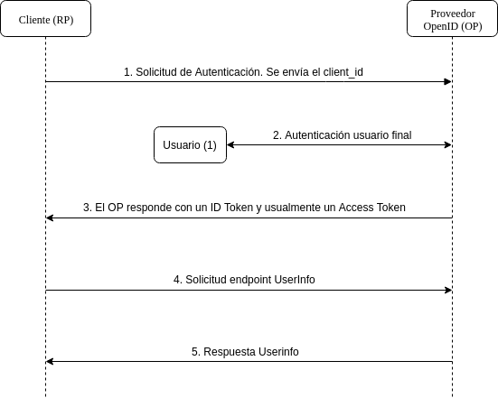
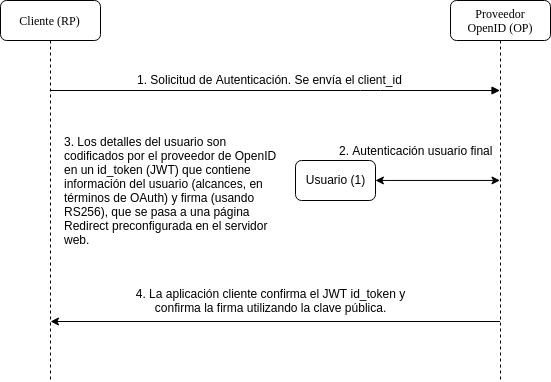

**OpenID Connect** soporta distintos flujos de autenticación:

1. Authentication Flow
2. Implicit Flow

1. El **Authentication Flow** (o flujo básico) está diseñado para aplicaciones que tienen un back-end que puede comunicarse con el IdP.

2. El **Implicit Flow** es necesario para las aplicaciones que no tienen lógica "back-end" en el servidor web, como una aplicación Javascript.

### Authentication Flow

### Implicit Flow

